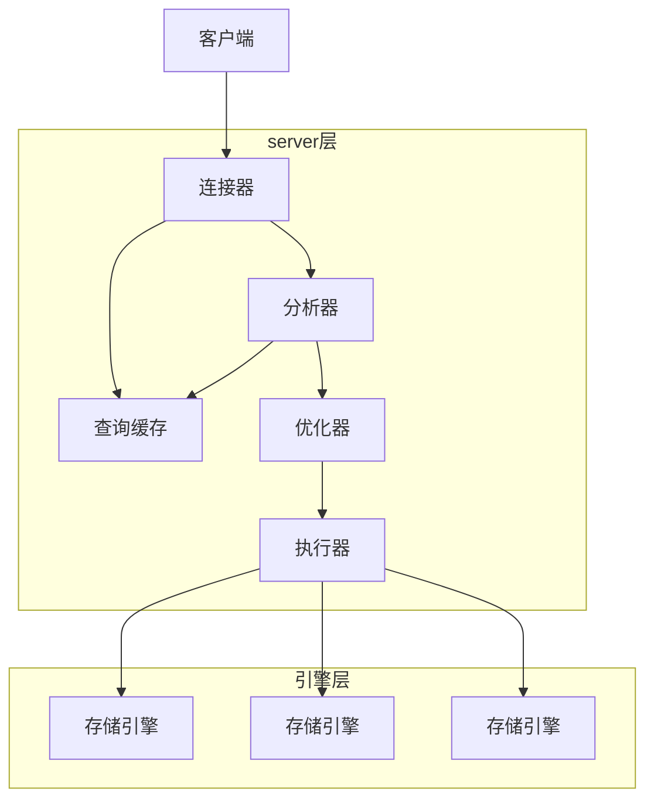

# 查询语句是如何执行的



## 连接器

* 跟客户端建立连接,获取权限,维持和管理连接
* 一个连接拥有的权限是在连接建立的时候获取的,修改一个用户的权限,已经建立的连接的权限不会改变,如果要获取最新的权限需要重置当前已经建立的连接
  * **短连接 or 长连接?** 短连接指:执行完很少的几次查询就断开连接,后续查询在建立新的连接.长连接指:连接一但建立,客户端持续有请求都会使用同一个连接.大量使用短连接是肯定不科学的, 连接的建立是一个非常复杂的过程(tcp握手,权限验证,资源分配等),应该尽量使用长连接,长连接最大的问题是比较耗内存,mysql在执行过程中临时使用的内存是管理在连接对象里面的, 这些资源会在连接断开的时候才释放<br>**最佳实践:**1.定期断开长连接2.mysql5.7+ 通过mysql_reset_connect来重新初始化连接资源,这个过程不需要重新建立连接和权限验证,但会将连接恢复到刚刚创建完成时的状态

## 查询缓存

比较鸡肋,在表上有任何更新动作,与该表相关的查询缓存会全部失效,对于更新压力大的表,缓存更新频繁,命中率低,缓存在mysql8.0版本直接干掉了.<br>**最佳实践:**默认不使用查询缓存,需要的时候在查询语句里面使用SQL_CACHE显示开启

```sql
select SQL_CACHE * from T  where id=1;
```

## 分析器

词法分析和语法分析

## 优化器

表里面有多个索引的时候决定使用哪个索引,一个语句有多表关联(join)的时候,决定各个表的连接顺序等.优化器阶段完成后,这个语句的执行方案就确定下来了

## 执行器

调用存储引擎接口获取数据行, 在数据库慢查询日志看到一个row_examined字段,这个值就是执行器每次调用引擎获取数据行的时候累加的.在有些场景下,执行器调用一次,在引擎内部则扫描了多行,因此引擎扫描行数跟rows_examined并不完全相同

# 更新语句是如何执行的

```sql
mysql> create table T(ID int primary key, c int);
mysql> update T set c=c+1 where ID=2;
```
* 清空T表上所有的查询缓存

* WAL技术(write-ahead-logging),先写日志,在写磁盘, redolog与binlog.《孔乙己》掌柜的粉板与账本,有人要赊账或者还账,先记在粉板上,等粉板满了或者打烊后空闲下来在把粉板上的内容记录到账本上.

* redolog是innodb存储引擎特有的,循环写,物理日志-记录的是某个数据页做了什么修改

* binlog(归档日志),server层的日志,追加写,逻辑日志-记录的是语句的原始逻辑,比如给ID=2这一行的c字段加1

* mysql双一设置:**innodb_flush_log_at_trx_commit=1**,每次事务的redo log都持久化到磁盘,这样可以保证mysql异常重启后redolog不丢失, **sync_binlog=1**,每次事务的bin log都持久化到磁盘,这样可以保证mysql异常重启后bin log不丢失
```mermaid
flowchart TB
取id=2这一行:::someclass --> 数据页在内存中?{数据页在内存中?}
数据页在内存中? -->|是| 返回行数据
数据页在内存中? -->|否| 磁盘中读入内存
磁盘中读入内存 --> 返回行数据 --> c1[将这行的c值加1,写入新行]:::someclass 
--> 新行更新到内存,写入redolog处于prepare阶段 --> 写binlog:::someclass --> 提交处于commit状态
classDef someclass fill:#f96;
```
<div align = "center">update语句执行流程(黄色:server层执行,蓝色:innodb执行)</div>

# 事务隔离:为什么你改了我还看不见

## 事务隔离级别

| 隔离级别                 | 特性                                                         | 存在的问题 |
| ------------------------ | ------------------------------------------------------------ | ---------- |
| 读未提交read uncommitted | 一个事务能够读到其他事务未提交的修改                         | 脏读       |
| 读已提交read committed   | 一个事务能够读到的数据都是其他事务已经提交的修改             | 不可重复读 |
| 可重复读repeatable read  | 一个事务执行过程中看到数据,总是和这个事务启动时看到的数据一致的 | 幻读       |
| 串行化serializable       | 对同一行记录读会加读锁,写会加写锁,读写锁,写写锁冲突,会先等一方释放,读读锁不会冲突 |            |

* 事务隔离级别例子

    ```sql
    mysql> create table T(c int) engine=InnoDB;
    insert into T(c) values(1);
    ```

    | 会话A                   | 会话B                   |
    | ----------------------- | ----------------------- |
    | 启动事务A,查询得到值为1 | 启动事务B               |
    |                         | 查询得到值为1,修改值为2 |
    | 查询得到值为V1          |                         |
    |                         | 提交事务B               |
    | 查询得到值为V2          |                         |
    | 提交事务A               |                         |
    | 查询得到值为V3          |                         |

    在不同隔离级别下V1,V2,V3的值

    | <span style="display:inline-block;width:100px">隔离级别</span> | V1   | V2   | V3   |
    | ------------------------------------------------------------ | ---- | ---- | ---- |
    | 读未提交                                                     | 2    | 2    | 2    |
    | 读已提交                                                     | 1    | 2    | 2    |
    | 可重复读                                                     | 1    | 1    | 2    |
    | <span style="display:inline-block;width:100px">串行化(在事务A提交完成之前,事务b会一直处于阻塞状态)</span> | 1    | 1    | 2    |

## 事务隔离级别实现

会记录每条数据的修改记录,同一条数据在系统里可以存在多个版本,这就是数据库的多版本并发控制(MVCC)

回滚段在确定没有事务会使用到的时候才删除,尽量避免使用长事务,长事务影响回滚段的大小,还占用锁资源

## 事务的启动方式

* 显示启动 begin/start transacion -> rollbak / commit
* 自动提交VS手动提交, autocommit=0,关闭自动提交,意味着每次执行增删改查语句都会开启事务,除非显示使用commit或者roolback命令,否则一直处于事务当中.autocommit=1.开启自动提交,每次执行增删改查语句会开启事务,执行完成之后自动提交事务.建议开启自动提交,如果需要多条语句在同一个事务当中,可显示使用begin/start transacion -> rollbak / commit语句.还可以使用commit work and chain 来提交一个事务并开启下一个事务

# 深入浅出索引

## 索引的常见模型

* 哈希表: 根据key找value非常快O(1)时间复杂度,不适合范围查找
* 数组: 适合范围查找,新增/修改/删除成本比较大,需要移动数组的元素
* 搜索树(二叉树,N叉树,B+树,LSM树): 

## InnoDB的索引模型

InnoDB使用B+树作为索引模型,按索引组织表,一个索引就对应一颗B+树.有如下的一张表:

```sql
mysql> create table T(id int primary key, k int not null, name varchar(16),index (k))engine=InnoDB;
```

表中 R1~R5 的 (ID,k) 值分别为 (100,1)、(200,2)、(300,3)、(500,5) 和 (600,6)，两棵树的示例示意图如下。


**主键索引**(也叫聚簇索引):叶子节点的数据页上是每条数据完整的记录
**非主键索引**(也叫二级索引,非聚簇索引,普通索引):叶子节点是主键的值,按非主键索引查找数据,找到符合条件数据的主键后,还需要扫描主键索引拿到最终的记录,这个过程称为**回表**.
**索引的维护**: 为了维护索引的有序性,在树中插入节点可能存在页分裂, 页分裂需要移动数据,性能自然会受到影响,页分裂之后如果在空位上没有后续数据插入,存储的利用率也会降低.  所以应该尽量避免页分裂,这也是为什么推荐保证主键或者索引字段单调递增的原因. 在者主键字段不宜过长,如果过长,其他索引的叶子节点也会占据更多的存储空间
**索引重建**:为什么要重建索引,索引因为删除或者页分裂等原因,数据页可能存在空洞,重建索引就是新创建一个与原来一样的索引,把数据按顺序插入,提高数据页利用率,使索引更紧凑,更省空间
**覆盖索引原则:**非主键索引能够满足需要查询的所有字段就不需要在回到主键索引去查询主键对应的值(回表).又到举例子的时候了, 还是上面的表T,select id from T where k=3,这条语句会使用索引树K,查到k=3时id=300,由于只查询了id这一个字段,完全能满足查询要求,不需要在拿id=3去主键索引树里面在查找一次了,如果是select * from T where k=3,则在索引树K定位id=3之后,不能覆盖查询妖气,还需要在主键索引树找到id=3的记录才能满足查询条件.覆盖索引也常用在联合索引上.
在举个例子,有张市民表:

```sql
CREATE TABLE `tuser` (
  `id` int(11) NOT NULL,
  `id_card` varchar(32) DEFAULT NULL,
  `name` varchar(32) DEFAULT NULL,
  `age` int(11) DEFAULT NULL,
  `ismale` tinyint(1) DEFAULT NULL,
  PRIMARY KEY (`id`),
  KEY `id_card` (`id_card`),
  KEY `name_age` (`name`,`age`)
) ENGINE=InnoDB
```

如果我们在建立一个(身份证号,姓名)的联合索引,根据身份证号查用户姓名,就符合覆盖索引的规则,不需要回表查整行记录,效率会非常高
**最左前缀原则:**


